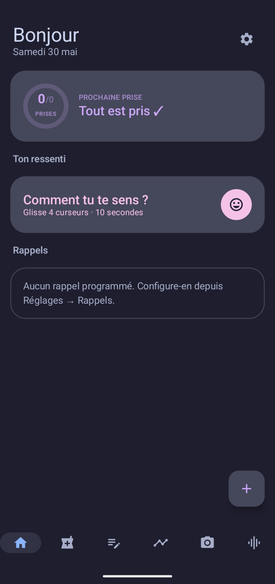
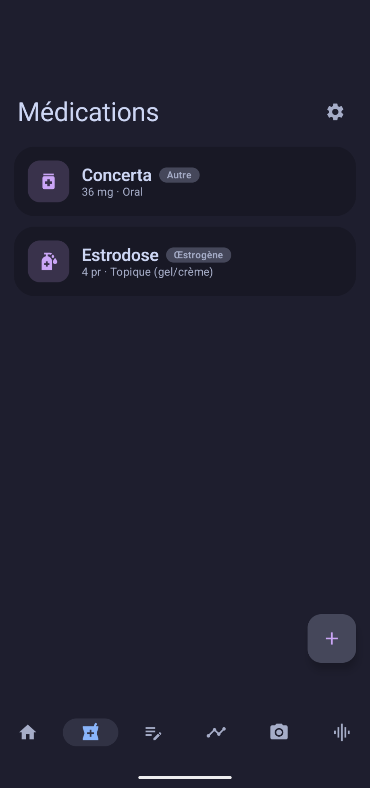
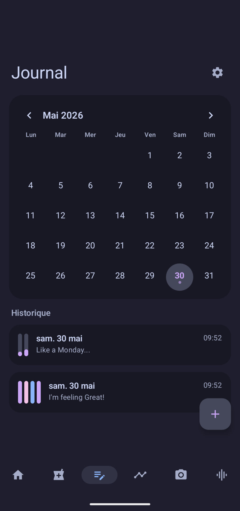
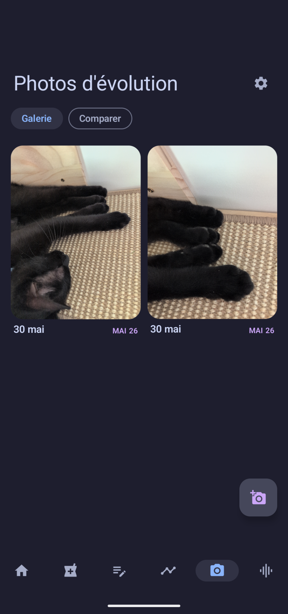
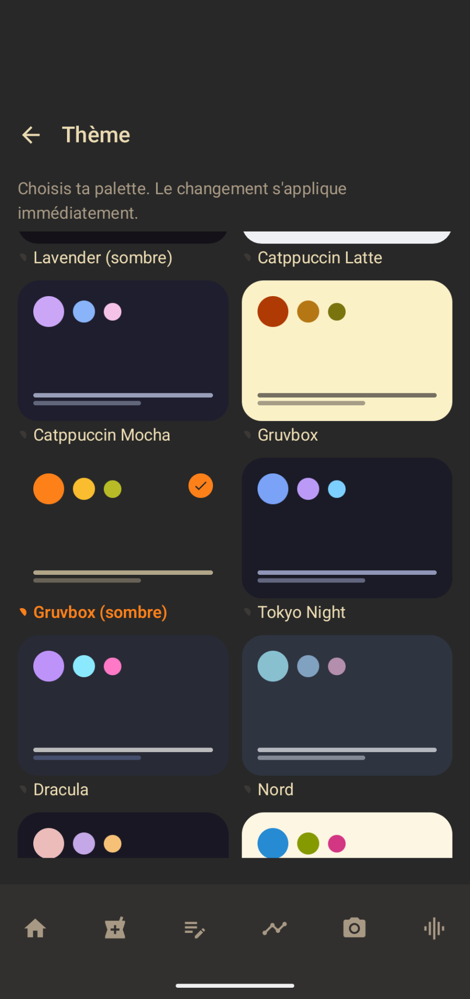
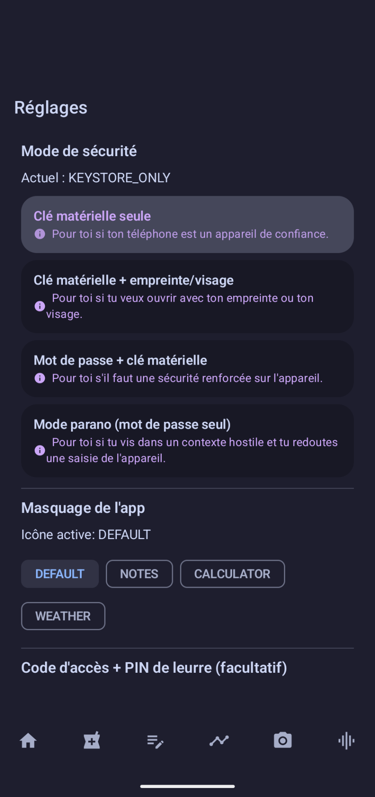
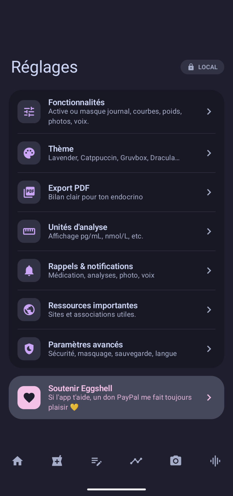

Native transition tracking app — built for, and with, trans people.

**Everything stays on your phone.** No account, no server, no analytics.
Encrypted SQLite database (SQLCipher), biometric or PIN unlock, and a
*decoy* mode for hostile contexts.

> Status: **1.0.0** — signed APKs are published on GitHub Releases and the
> iOS app is published on the Apple App Store. The app has not yet had a
> third-party security audit: don't trust it with data you can't afford to
> lose or leak.

## Features

- **Medication** — log hormone and anti-androgen doses (gel, patch, pill,
  injection), with dosage, per-intake route, injection site rotation,
  back-dating, date-range logging (e.g. a daily gel declared for months in
  one action) and in-place editing of past intakes.
- **Reminders** — reliable notifications scheduled via `AlarmManager`,
  re-armed after reboot; full CRUD with optional custom text per reminder,
  lab/photo/voice/journal check-ins, and a single hub listing everything
  the app may fire.
- **Journal** — mood, dysphoria/euphoria, libido, physical and side effects;
  quick sliders (customizable) or detailed entry; monthly calendar with
  period band and per-medication dots to eyeball correlations.
- **Cycle tracking** — periods and spotting with symptoms sliders, for any
  past day or a whole span at once. No cycle prediction, by design.
- **Hormone levels** — log lab results manually or import lab PDFs (text
  or OCR, password-protected PDFs supported), including blood pressure,
  hemoglobin and hematocrit; dated trend curves with dose markers,
  configurable units.
- **Appointments** — upcoming visits with notes, to-dos and one-shot
  reminders.
- **Summary** — week/month recap vs the previous one: mood, logged vs
  planned intakes, symptoms.
- **Photo timeline** — dated progress photos with before/after comparison,
  stored in the encrypted vault.
- **Voice tracking** — short voice clips, pitch detection, timeline view.
- **PDF export** — a clear report (medication, charts, journal) to share
  with your endocrinologist.
- **Privacy** — local encryption, decoy mode (icon + decoy screen), icon
  alias, content masking in the recents/background.
- **Widget** — your next dose visible from the home screen.

## Screenshots

| Home | Medication | Journal | Timeline |
|------|------------|---------|----------|
|  |  |  |  |

| Themes | Encryption | Settings |
|--------|------------|----------|
|  |  |  |

## Privacy model

- **Storage**: SQLite encrypted via SQLCipher. The database key is derived
  with Argon2id from your unlock secret.
- **Unlock**: PIN or biometric. The biometric secret is wrapped in the
  Android Keystore (non-exportable key, bound to the TEE / StrongBox where
  available).
- **Rate limiting**: PIN attempts are throttled with exponential backoff.
- **Decoy mode**: a secondary secret opens a harmless calculator/notes
  screen, revealing no trace of the real data's existence.
- **Icon alias**: the app can present itself under a calculator or weather
  icon.
- **No network**: zero outbound requests, zero analytics, zero crash
  reporting. You can verify this yourself in `AndroidManifest.xml`
  (`android.permission.INTERNET` is not requested).

## Architecture

Business logic in Rust, shared with a Kotlin/Compose Android UI. The bridge
between them is generated by [UniFFI](https://mozilla.github.io/uniffi-rs/).

```
core/                       Cargo workspace (shared business logic)
├── transition-core/        main crate (db, crypto, medication, hormones,
│                           journal, cycle, appointments, photos, voice, vault)
├── transition-uniffi/      cdylib + staticlib + UDL exposed via UniFFI
└── transition-cli/         local debug binary

android/                    Gradle project (Compose Material3 + Hilt)
└── app/                    UI, reminders, security, widget, data repos

apple/                      iOS port (SwiftUI), same core/ via UniFFI Swift
├── Eggshell/               app sources (XcodeGen project)
├── TransitionCore/         SwiftPM package wrapping the xcframework
└── build-ios.sh            Rust core → xcframework + Swift bindings

scripts/build-android.sh    wrapper for iterating on the Rust side
                            without Gradle
```

The iOS port shares the same encrypted database format and medication
catalog identifiers as Android (see `apple/PARITY-ANDROID-IOS.md`); it is
built and uploaded to TestFlight by the GitHub workflows (no local Mac
needed — see `.github/workflows/ios-*.yml`).

## Install

### End users

- [x] **Apple App Store (iOS)** — published. Each release build is
  produced and uploaded to App Store Connect by the `ios-testflight`
  workflow on an `ios-v*` tag, then released from there.
- [x] **GitHub Releases (signed APK)** — download the latest
  `eggshell-<version>.apk` from the
  [Releases page](../../releases) and sideload it. Built and signed by the
  `android-release` GitHub workflow on every `android-v*` tag.
- [ ] Google Play Store
- [ ] F-Droid

Or build from source (see below).

### From source

**Prerequisites**:

- Rust **≥ 1.82** (`rustup toolchain install stable`)
- Android Rust targets:
  ```bash
  rustup target add aarch64-linux-android armv7-linux-androideabi \
                    x86_64-linux-android i686-linux-android
  ```
- `cargo-ndk`: `cargo install cargo-ndk`
- JDK 21+
- Android SDK + NDK (via Android Studio → SDK Manager → SDK Tools → NDK)
- Export `ANDROID_HOME` (or `ANDROID_SDK_ROOT`) and `ANDROID_NDK_HOME`

**First-time setup**:

```bash
# Local Android config (SDK paths)
cp android/local.properties.example android/local.properties
# edit if needed to point at your SDK

# For signed release builds: keystore (skip for debug-only)
cp keystores/keystore.properties.example keystores/keystore.properties
# fill in your keystore path and passwords
```

`android/local.properties` and `keystores/` are git-ignored — never commit
anything inside them.

**Verify the Rust core**:

```bash
cd core && cargo test
cargo run -p transition-cli -- test  # prints "Bonjour test depuis Rust"
```

**Debug Android build**:

```bash
cd android && ./gradlew assembleDebug
# On first run, Gradle downloads itself (~150 MB)
```

**Release build (signed APK)**:

```bash
# Requires keystores/keystore.properties to be set up
cd android && ./gradlew assembleRelease
```

**Fast Rust-only iteration**:

```bash
scripts/build-android.sh           # release for the target ABIs
scripts/build-android.sh debug     # debug profile
```

## Tests

```bash
cd core && cargo test              # Rust unit tests
cd android && ./gradlew test       # Kotlin JVM tests
cd android && ./gradlew connectedAndroidTest  # instrumented (device/emulator)
```

## Contributing

Issues and PRs are welcome, especially on:

- Security (audit of the crypto/vault, suggestions for the decoy mode)
- Accessibility (TalkBack/VoiceOver, contrast, font sizes)
- Translations (the app ships French + English; more locales welcome)
- iOS (the SwiftUI port tracks Android feature-for-feature — device
  testing and polish are where help is most useful)

For anything touching privacy or putting users at risk: please use a
GitHub *security advisory* rather than a public issue.

## License

[GPL-3.0-or-later](LICENSE), with an [additional permission](LICENSE.exceptions)
under section 7 of the GPL that allows distribution through app stores
(Apple App Store, Google Play, F-Droid, etc.) whose terms of service would
otherwise conflict with the GPL.

The base license is a deliberate choice: it prevents a proprietary fork
(that could strip the vault, exfiltrate data, or weaken the decoy mode)
from being redistributed under the same name. The additional permission
exists only to make multi-store distribution legally clean — the source
code itself stays fully GPL.
